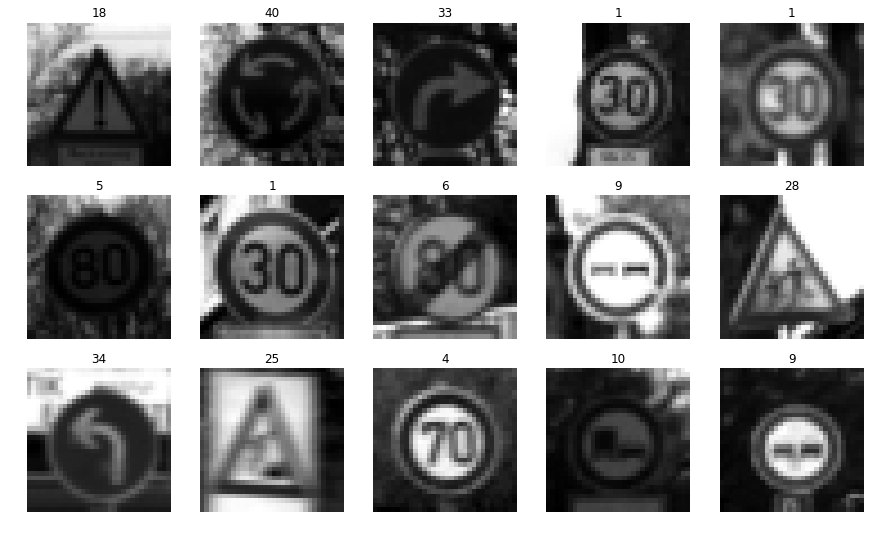
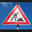

#**Traffic Sign Recognition** 

##Writeup Template

###You can use this file as a template for your writeup if you want to submit it as a markdown file, but feel free to use some other method and submit a pdf if you prefer.

---
**Build a Traffic Sign Recognition Project**

The goals / steps of this project are the following:
* Load the data set (see below for links to the project data set)
* Explore, summarize and visualize the data set
* Design, train and test a model architecture
* Use the model to make predictions on new images
* Analyze the softmax probabilities of the new images
* Summarize the results with a written report

[//]: # (Image References)

[image1]: ./examples/visualization.jpg "Visualization"
[image2]: ./examples/grayscale.jpg "Grayscaling"
[image3]: ./examples/random_noise.jpg "Random Noise"
[image4]: ./examples/placeholder.png "Traffic Sign 1"
[image5]: ./examples/placeholder.png "Traffic Sign 2"
[image6]: ./examples/placeholder.png "Traffic Sign 3"
[image7]: ./examples/placeholder.png "Traffic Sign 4"
[image8]: ./examples/placeholder.png "Traffic Sign 5"

## Rubric Points
###Here I will consider the [rubric points](https://review.udacity.com/#!/rubrics/481/view) individually and describe how I addressed each point in my implementation.  

---
###Writeup / README

####1. Provide a Writeup / README that includes all the rubric points and how you addressed each one. You can submit your writeup as markdown or pdf. You can use this template as a guide for writing the report. The submission includes the project code.

You're reading it! and here is a link to my [project code](https://github.com/udacity/CarND-Traffic-Sign-Classifier-Project/blob/master/Traffic_Sign_Classifier.ipynb)

###Data Set Summary & Exploration

####1. Provide a basic summary of the data set. In the code, the analysis should be done using python, numpy and/or pandas methods rather than hardcoding results manually.

I used the pandas library to calculate summary statistics of the traffic
signs data set:

* The size of training set is ? 34799
* The size of the validation set is ? 4410
* The size of test set is ? 12630
* The shape of a traffic sign image is ? (32,32,3)
* The number of unique classes/labels in the data set is ? 43

####2. Include an exploratory visualization of the dataset.

Here is an exploratory visualization of the data set. It is a bar chart showing how the data ...

###Design and Test a Model Architecture

####1. Describe how you preprocessed the image data. What techniques were chosen and why did you choose these techniques? Consider including images showing the output of each preprocessing technique. Pre-processing refers to techniques such as converting to grayscale, normalization, etc. (OPTIONAL: As described in the "Stand Out Suggestions" part of the rubric, if you generated additional data for training, describe why you decided to generate additional data, how you generated the data, and provide example images of the additional data. Then describe the characteristics of the augmented training set like number of images in the set, number of images for each class, etc.)

As a first step, I decided to convert the images to grayscale because the orgin image shape is [32,32,3], i must change it to [32,32,1].then i can use LeNet

Here is an example of a traffic sign image before and after grayscaling.

As a last step, I normalized the image data because normalize the label between -1 and 1

I decided to never generate additional data because i think the picture is clear. 

####2. Describe what your final model architecture looks like including model type, layers, layer sizes, connectivity, etc.) Consider including a diagram and/or table describing the final model.

I use modified LeNet final 

then, i lookfor the paper

My final model consisted of the following layers:

| Layer         		|     Description	        					| 
|:---------------------:|:---------------------------------------------:| 
| Input         		| 32x32x1 RGB image   							| 
| Convolution 5x5     	| 5x5 stride, same padding, outputs 28x28x6 	|
| RELU					|												|
| Max pooling	      	| 2x2 stride,  outputs 14x14x6 				    |
| Convolution 5x5	    | 5x5 stride, same padding, outputs 10x10x16    |
| RELU		            |         									    |
| Max pooling			| 2x2 stride,  outputs 5x5x16        			|
| Convolution 5x5       | 5x5 stride, same padding, outputs 1x1x400    |
| RELU		            |         									    |
| Flattern		        | outputs 1x400									|
| Flattern	layer2  	| flatten 5x5x16 outputs  400					|
| concat                | concat 2 flattern layer, output 800           |                 |                                               |
| Fully Connected       | outputs 43                                    |
 

####3. Describe how you trained your model. The discussion can include the type of optimizer, the batch size, number of epochs and any hyperparameters such as learning rate.

To train the model, I used LeNet, because the gray image size if (32,32,1) the same as the mnist example. so i use LeNet

####4. Describe the approach taken for finding a solution and getting the validation set accuracy to be at least 0.93. Include in the discussion the results on the training, validation and test sets and where in the code these were calculated. Your approach may have been an iterative process, in which case, outline the steps you took to get to the final solution and why you chose those steps. Perhaps your solution involved an already well known implementation or architecture. In this case, discuss why you think the architecture is suitable for the current problem.

My final model results were:
* training set accuracy of ? **0.999**
* validation set accuracy of ? **0.952**
* test set accuracy of ? **0.934** 

If an iterative approach was chosen:
* What was the first architecture that was tried and why was it chosen? because the gray image size if (32,32,1) the same as the mnist example. so i use LeNet
* What were some problems with the initial architecture? slow, i train all the data one time, half 1 hour.
* How was the architecture adjusted and why was it adjusted? Typical adjustments could include choosing a different model architecture, adding or taking away layers (pooling, dropout, convolution, etc), using an activation function or changing the activation function. One common justification for adjusting an architecture would be due to overfitting or underfitting. A high accuracy on the training set but low accuracy on the validation set indicates over fitting; a low accuracy on both sets indicates under fitting.
    i never adjust first architecture, because i try many method, but the accuracy result is worse than 
* Which parameters were tuned? How were they adjusted and why? 
    **i use parameters**   
    1) EPOCHS = 20  (in test, i set EPOCHS 20, but at last i use (total/BATCH_SIZE)+1)
    2) BATCH_SIZE = 128
    3) Learing Rate = 0.001
    4) Dropout probability=0.5
    5) Hyperparameters: mu=0 , sigma=0.1
    in this parameters, the result us  
    validation accuracy = 0.958, test accuracy = 0.933   
     
    **changing BATCH_SIZE**  
    BATCH_SIZE = 128, EPOCHS = 20  =>  validation accuracy=0.938, test accuracy=0.915  
    BATCH_SIZE = 64, EPOCHS = 20  =>  validation accuracy=0.923, test accuracy=0.914  
    BATCH_SIZE = 96, EPOCHS = 20  =>  validation accuracy=0.920, test accuracy=0.916  
    BATCH_SIZE = 160, EPOCHS = 20  =>  validation accuracy=0.915, test accuracy=0.913  
    BATCH_SIZE = 192, EPOCHS = 20  =>  validation accuracy=0.932, test accuracy=0.910  
    BATCH_SIZE = 256, EPOCHS = 20  =>  validation accuracy=0.918, test accuracy=0.907  
    so the BATCH_SIZE is too small or too large,the result is not good  
     
    **changing EPOCHS**   
    BATCH_SIZE = 128, EPOCHS = 20  =>  validation accuracy=0.938, test accuracy=0.915  
    BATCH_SIZE = 128, EPOCHS = 10  =>  validation accuracy=0.906, test accuracy=0.902  
    BATCH_SIZE = 128, EPOCHS = 15  =>  validation accuracy=0.931, test accuracy=0.916  
    BATCH_SIZE = 128, EPOCHS = 25  =>  validation accuracy=0.929, test accuracy=0.915  
    BATCH_SIZE = 128, EPOCHS = 30  =>  validation accuracy=0.932, test accuracy=0.924  
    BATCH_SIZE = 128, EPOCHS = 40  =>  validation accuracy=0.938, test accuracy=0.923  
    BATCH_SIZE = 128, EPOCHS = 60  =>  validation accuracy=0.932, test accuracy=0.917  
    BATCH_SIZE = 128, EPOCHS = 90  =>  validation accuracy=0.946, test accuracy=0.927  
    generally, the EPOCHS is more bigger, the result is more good,except overfiting  
     
    **changing learing rate**  
    Learing Rate = 0.001  => validation accuracy=0.938, test accuracy=0.915  
    Learing Rate = 0.0001 => validation accuracy=0.830, test accuracy=0.820  
    Learing Rate = 0.0005 => validation accuracy=0.905, test accuracy=0.895  
    Learing Rate = 0.0008 => validation accuracy=0.906, test accuracy=0.896  
    Learing Rate = 0.0009 => validation accuracy=0.905, test accuracy=0.896  
    Learing Rate = 0.002  => validation accuracy=0.934, test accuracy=0.917  
    Learing Rate = 0.003  => validation accuracy=0.904, test accuracy=0.906  
    Learing Rate = 0.004  => validation accuracy=0.919, test accuracy=0.910  
    Learing Rate = 0.006  => validation accuracy=0.889, test accuracy=0.888  
    Learing Rate = 0.008  => validation accuracy=0.918, test accuracy=0.907  
    Learing Rate = 0.01   => validation accuracy=0.888, test accuracy=0.881  
    Learing Rate = 0.02   => validation accuracy=0.828, test accuracy=0.817  
    Learing Rate = 0.04   => validation accuracy=0.054, test accuracy=0.057  
    so the learing rate is too small or too large,the result is not good  
      
    **changing dropout**  
    dropout = 0.5  => validation accuracy=0.938, test accuracy=0.915  
    dropout = 0.1  => validation accuracy=0.875, test accuracy=0.872  
    dropout = 0.2  => validation accuracy=0.927, test accuracy=0.909  
    dropout = 0.3  => validation accuracy=0.917, test accuracy=0.911  
    dropout = 0.4  => validation accuracy=0.927, test accuracy=0.916  
    dropout = 0.6  => validation accuracy=0.927, test accuracy=0.914  
    dropout = 0.7  => validation accuracy=0.943, test accuracy=0.915  
    dropout = 0.8  => validation accuracy=0.909, test accuracy=0.904  
    dropout = 0.9  => validation accuracy=0.912, test accuracy=0.909  
    dropout = 1.0  => validation accuracy=0.929, test accuracy=0.912  
    so the dropout is too small or too large,the result is not good  
     
    for these test case above, so finally, i set nearly best parameters  
    
* What are some of the important design choices and why were they chosen? For example, why might a convolution layer work well with this problem? How might a dropout layer help with creating a successful model?  
    i tryed dropout layer when 400->120 or 120->85 or 85-43, but the accuracy result is less than final architecture,so at last, i never use dropout layer in this case  

If a well known architecture was chosen: 
* What architecture was chosen? LeNet, as my first model
* Why did you believe it would be relevant to the traffic sign application? i never believe, but i try many other architecture, the result is worse than LeNet
* How does the final model's accuracy on the training, validation and test set provide evidence that the model is working well? 
    the test accuracy is 0.933 , better than normal LeNet, i just apple the paper. 

###Test a Model on New Images

####1. Choose five German traffic signs found on the web and provide them in the report. For each image, discuss what quality or qualities might be difficult to classify.

Here are five German traffic signs that I found on the web:

  Right-of-way at the next intersection

 Speed limit (30km/h)

 Priority road

 Keep right

 Turn left ahead

 General caution

 Road work

 Speed limit (60km/h)

####2. Discuss the model's predictions on these new traffic signs and compare the results to predicting on the test set. At a minimum, discuss what the predictions were, the accuracy on these new predictions, and compare the accuracy to the accuracy on the test set (OPTIONAL: Discuss the results in more detail as described in the "Stand Out Suggestions" part of the rubric).

Here are the results of the prediction:

| Image			        |     Prediction	        					| 
|:---------------------:|:---------------------------------------------:| 
| Speed limit (60km/h)  | Speed limit (60km/h)  		| 
| Right-of-way at the next intersection   | Right-of-way at the next intersection |
| Speed limit (30km/h)	| Speed limit (30km/h)										|
| Priority road    	| Priority road 					 	|
| Keep right		| Keep right      				|
| Turn left ahead  | Turn left ahead |
| General caution  | General caution |
| Road work        | Road work |

The model was able to correctly guess 7 of the 8 traffic signs, which gives an accuracy of 87.5%. 
This compares favorably to the accuracy on the test set of 92.6%

####3. Describe how certain the model is when predicting on each of the five new images by looking at the softmax probabilities for each prediction. Provide the top 5 softmax probabilities for each image along with the sign type of each probability. (OPTIONAL: as described in the "Stand Out Suggestions" part of the rubric, visualizations can also be provided such as bar charts)

The code for making predictions on my final model is located in the 11th cell of the Ipython notebook.

For the first image, the model is relatively sure that this is a stop sign (probability of 0.6), and the image does contain a stop sign. The top five soft max probabilities were

| Probability         	|     Prediction	        					| 
|:---------------------:|:---------------------------------------------:| 
| .100         			| Right-of-way at the next intersection  									| 
| .0     				|  										|
| .0					| 											|
| .0	      			| 					 				|
| .0				    |      							|

For the second image ... 

| Probability         	|     Prediction	        					| 
|:---------------------:|:---------------------------------------------:| 
| .100         			| Speed limit (60km/h)									| 
| .0     				| 										|
| .0					| 									|
| .0	      			| 					 				|
| .0				    |     							|

i show the picture 

### (Optional) Visualizing the Neural Network (See Step 4 of the Ipython notebook for more details)
####1. Discuss the visual output of your trained network's feature maps. What characteristics did the neural network use to make classifications?

I solved this optional problem, and i print 4 layers,images ,28x28x6 and 14x14x6 and 10x10x16 and 5x5x16
i find every images, that is nearly more further much for the orginal image. because there so many paramenters that human think. 
